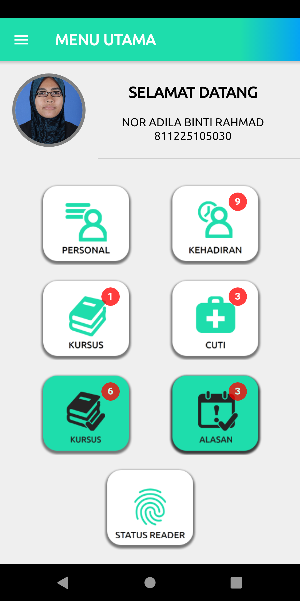
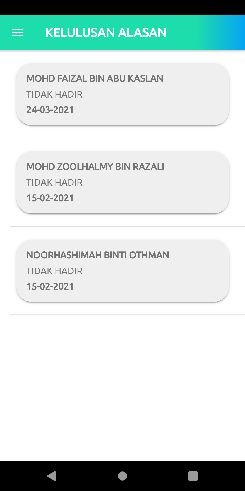
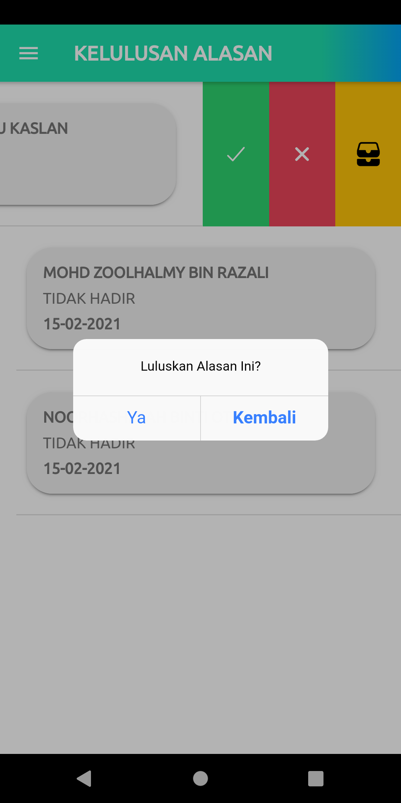
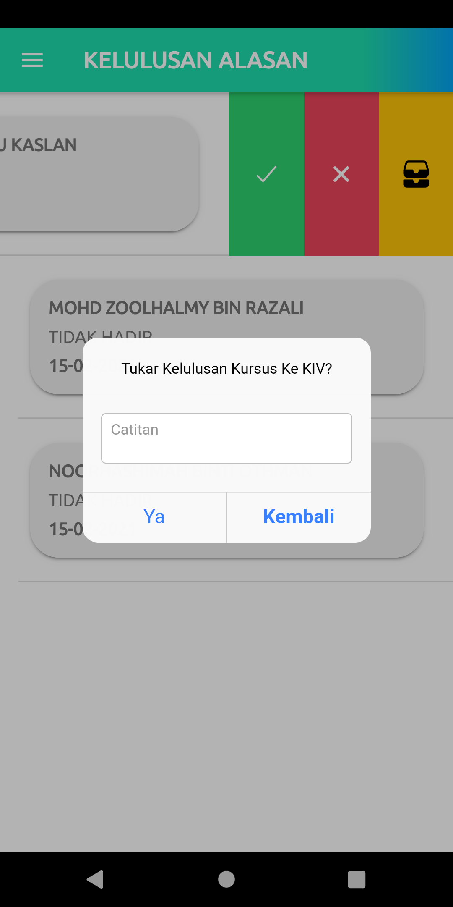
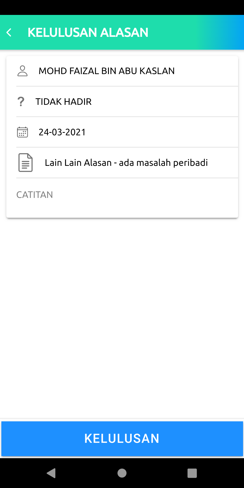
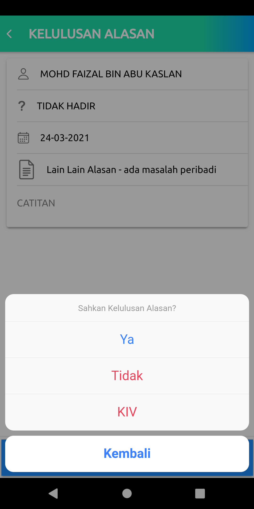

# Modul Kelulusan Alasan

1. [Pelulus lihat senarai alasan untuk kelulusan](#pelulus-lihat-senarai-alasan-untuk-kelulusan)
2. [Pelulus beri kelulusan](#pelulus-beri-kelulusan)

   

## Pelulus lihat senarai alasan untuk kelulusan

1. Selepas log masuk, pengguna akan melihat halaman antaramuka seperti di bawah. 
   Klik 'ALASAN' untuk ke modul kelulusan alasan.

   

2. Senarai kelulusan alasan akan dipaparkan seperti berikut. 
   Untuk melihat lebih maklumat, klik nama pegawai. Manakala untuk membuat kelulusan secara dari senarai, 'swipe' ke kiri.

   

   

   

## Pelulus Beri Kelulusan

1. Berikut adalah antaramuka sekiranya pengguna memilih untuk swipe nama ke kiri. 

2. Terdapat 3 pilihan kelulusan:

   - Hijau : Lulus
   - Merah : Tidak Lulus
   - Kuning : KIV 

   

3. Sekiranya klik setiap pilihan, notifikasi alert akan dipaparkan seperti berikut:

   - Hijau : Lulus
     

     

   - Merah : Tidak Lulus
     

     

   - Kuning : KIV 

      

4. Berikut pula adalah antaramuka sekiranya pengguna klik nama pegawai ketika di senarai. Paparan maklumat akan dipaparkan.
   Pengguna boleh juga membuat kelulusan di paparan ini. Masukkan CATITAN jika ada, klik KELULUSAN. 

   

5. Sejurus selepas pengguna klik kelulusan, pilihan kelulusan perlu dibuat. Pilih Ya/Tidak/KIV.

Setelah selesai, pengguna akan dinavigasi ke senarai alasan semula. 

